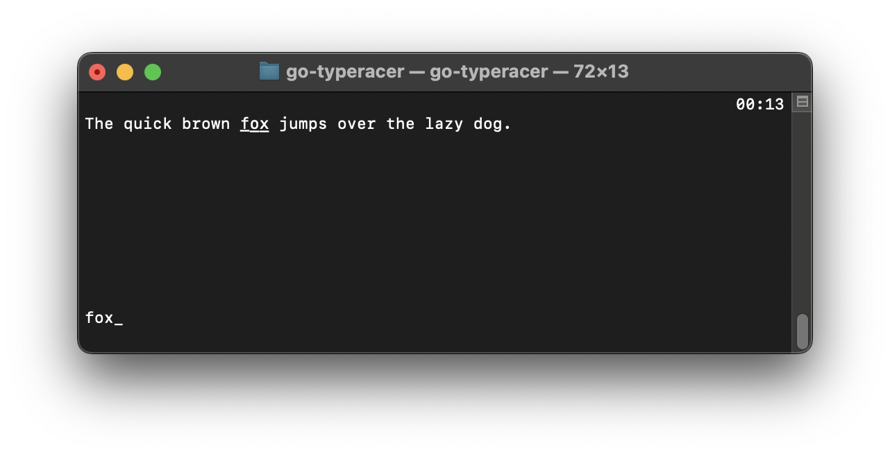
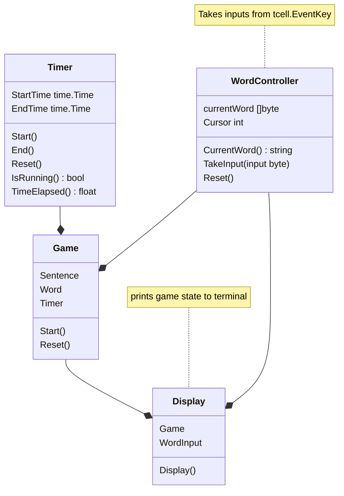

# TypeRacer

Implementing Typeracer on the command line.

## Usage

(The app is built for Mac / Unix for now -- I'll build for others in a bit!)

A screen by screen guide is in [pictures](./pictures) folder.

0. Run `./go-typeracer`
1. Press `'s'` to start.
2. Wait for the countdown to finish.
3. Start typing! You'll see the word to type underlined, and what you've typed below.
4. When finished, admire your time (or be disappointed by it) on the top right. Then press 's' to restart and 'q' to quit.

## UML Diagram

(I'm new to this so might get some things wrong :sweat_smile: don't judge me)

