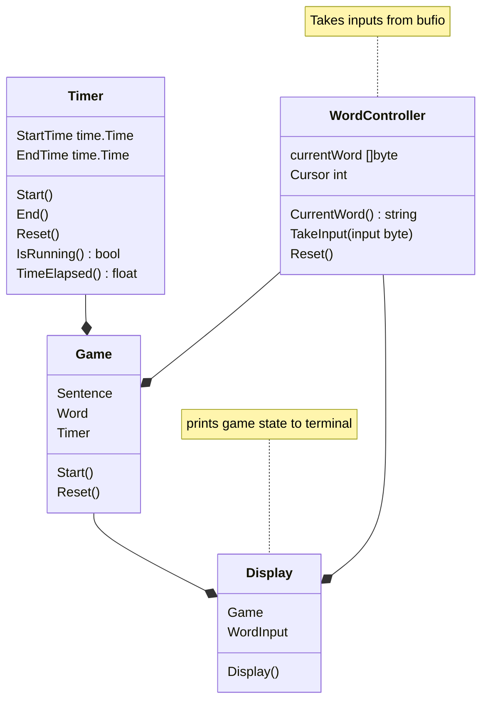

# TypeRacer

Implementing Typeracer on the command line.

## Usage

```bash
./typeracer start
```

Afterwards, you'll be presented with a quote to type and finish.

```bash
Know the enemy and know yourself; in a hundred battles you will never be defeated.


```

## UML Diagram

(I'm new to this so might get some things wrong 😅 don't judge me)


